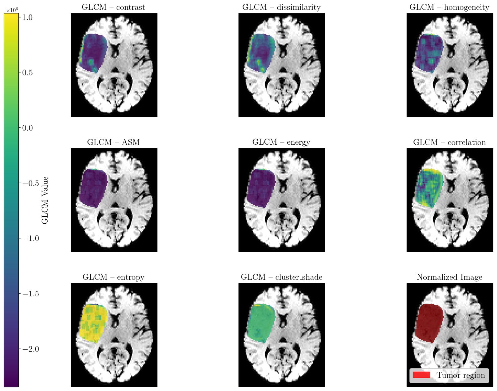

# Diplomado en Resonancia Magnética (MRI) - UNAB
## Módulo: Radiómica y *Machine Learning*

<p align="center">
  
</p>

Este repositorio contiene el material práctico y los códigos base utilizados para las clases de **Radiómica** y **Machine Learning (ML)** aplicados al análisis de imágenes de Resonancia Magnética (MRI), con un enfoque particular en la clasificación de tumores cerebrales (Gliomas).

---

## Estructura del Repositorio

El proyecto cuenta con dos cuadernos de Jupyter (`.ipynb`) principales que guían el flujo de trabajo biomédico en la carpeta `Codes`:

* **`radiomics.ipynb`**: Código enfocado en la extracción de características radiómicas a partir de secuencias de RM y segmentaciones (ROIs). Incluye análisis de forma, intensidad de píxel y texturas (matrices de co-ocurrencia, etc.).
* **`Glioma_classification.ipynb`**: Código dedicado a la etapa de **Machine Learning**. Toma las características extraídas (u otras bases de datos) para entrenar, validar y evaluar modelos de clasificación que permitan diferenciar tipos o grados de Gliomas.

---

## Requisitos e Instalación

* **Opción A:** Para ejecutar estos cuadernos de forma local, se recomienda contar con un entorno de Python (versión 3.8 o superior). 

1. **Clonar o descargar** este repositorio en tu máquina local:
   ```bash
   git clone [https://github.com/pamelaFranco/Diplomado MRI - UNAB.git](https://github.com/pamelaFranco/Diplomado MRI - UNAB.git)
   ```

2. **Instalar las librerías principales** necesarias para el procesamiento médico y el modelado:
  
   ```bash
   pip install pyradiomics numpy pandas scikit-learn matplotlib seaborn SimpleITK
   ```

(Nota: `pyradiomics` es la librería estándar para la extracción de características compatibles con IBSI).

3. Iniciar *Jupyter Lab / Notebook*:
   ```bash
   jupyter notebook
   ```

* **Opción B:** Descargar el archivo comprimido directamente en formato ZIP haciendo [clic aquí](https://github.com/pamelaFranco/Diplomado MRI - UNAB/archive/refs/heads/main.zip) (o desde el botón verde **"Code" > "Download ZIP"** en la parte superior de esta página de GitHub).

---

## Contenido Académico

**1. Extracción de Características**

**Cuaderno:** [](https://colab.research.google.com/github/pamelaFranco/Diplomado-MRI-UNAB/blob/main/Codes/radiomics.ipynb)

En esta sección práctica se aborda cómo transformar una imagen médica cualitativa en datos cuantitativos de alto rendimiento:

* Carga de volúmenes médicos (formatos .nii / .nii.gz).

* Configuración del extractor PyRadiomics (normalización de intensidad, remuestreo/resampling).

* Obtención de características de textura (GLCM).

**2. Clasificación de Gliomas**

**Cuaderno:** [](https://colab.research.google.com/github/pamelaFranco/Diplomado-MRI-UNAB/blob/main/Codes/Glioma_classification.ipynb)

A través de este cuaderno se introduce a los alumnos en el flujo de modelado predictivo, destacando el uso de **Inteligencia Artificial Explicable (XAI)** en medicina para la interpretación biofísica de los resultados:

* **Preprocesamiento y Curación de Datos:** Preparación y normalización estadística de la base de datos radiómica, simulando la carga diagnóstica y asegurando la consistencia antes del modelado.
* **Entrenamiento del Clasificador:** Implementación de un algoritmo basado en **Random Forest** (Bosques Aleatorios), ideal para la toma de decisiones complejas a partir de múltiples variables de textura e intensidad extraídas.
* **Panel de Diagnóstico Médico Interactivo:** Diseño de una interfaz dinámica (mediante *widgets*) que simula un entorno clínico real. Permite seleccionar diferentes pacientes de estudio (ej. *Paciente46*) para contrastar el diagnóstico predictivo de la IA con la referencia histológica real, reportando un nivel de confianza probabilístico.
* **Explicabilidad Médica con Valores SHAP (SHapley Additive exPlanations):** El núcleo analítico del código utiliza teoría de juegos cooperativos para calcular la contribución exacta de cada característica radiómica en la predicción final. Esto permite realizar un **Análisis Biofísico** visualizando qué descriptores de textura o forma específicos inclinaron la balanza hacia un diagnóstico de "Grado 2" o mayor.
* **Sección Académica de Discusión Metodológica:** Para finalizar el laboratorio, se guía a los estudiantes a reflexionar críticamente sobre los desafíos técnicos que impiden el uso inmediato de un modelo en la clínica real:
  1. El problema del desbalance de datos en bases de datos biomédicas.
  2. El impacto de los procesos estocásticos y el control de semillas aleatorias (`random_state`) para la reproducibilidad científica.
  3. El rol de la **Nested Cross-Validation (Validación Anidada)** como el estándar de oro para eliminar el *sesgo de selección* en la optimización de parámetros.

---


## Institución
Universidad Andrés Bello (UNAB)

Programa: Diplomado en Resonancia Magnética (MRI)

Propósito: Material docente / Laboratorio práctico.

--- 

## License

[](https://opensource.org/licenses/MIT)